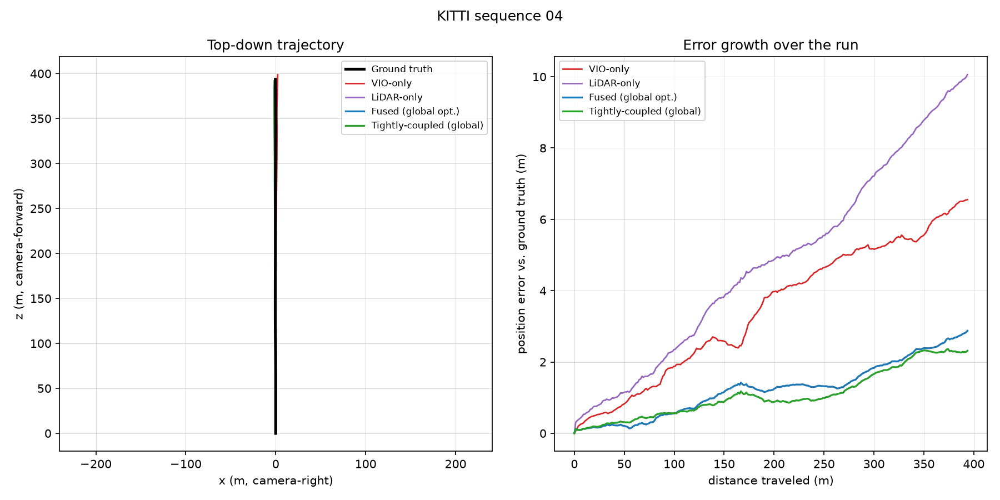

# slam

A LiDAR + visual-inertial SLAM system built from scratch in C++, meant as
the foundation for a larger robotics project rather than a one-off demo.
Front-ends and the backend optimizer are hand-implemented instead of
wrapping an existing SLAM framework. See [ROADMAP.md](ROADMAP.md) for the
module-by-module build plan and current status.

## Results

Measured on [KITTI odometry](https://www.cvlibs.net/datasets/kitti/eval_odometry.php)
sequence 04 — real stereo, LiDAR, and IMU data, no synthetic shortcuts. ATE is
Sturm et al.'s rigid-alignment RMSE; translation/rotation error follow the
official KITTI odometry protocol (100-800m segments), so these are directly
comparable to the leaderboard and to published LOAM/ORB-SLAM3 numbers.

| Method                    | ATE (m) | Trans. error (%) | Rot. error (deg/100m) |
|---------------------------|---------|-------------------|------------------------|
| VIO-only                  | 1.845   | 1.84              | 1.6979                 |
| LiDAR-only                | 2.329   | 2.22              | 0.8379                 |
| Fused (incremental)       | 0.538   | 0.83              | 0.5800                 |
| Fused (global opt.)       | 0.538   | 0.83              | 0.5800                 |
| Tightly-coupled (inc.)    | 0.536   | 0.78              | 0.5196                 |
| Tightly-coupled (global)  | 0.536   | 0.80              | 0.5165                 |

Fusing LiDAR with VIO cuts ATE by over 70% versus either sensor alone; the
tightly-coupled IMU factor gives a further small improvement, and IMU-based
initialization succeeds partway through this 271-frame sequence.



Sequence 04 is a near-straight ~400m highway segment, so the top-down view
mostly overlaps — the error-vs-distance panel is where fusion's advantage
actually shows up. It's also a weak test of turns; see "Evaluation" below to
reproduce this or run it on a sequence with more curvature.

## Architecture

```
sensors/         timestamped data types + KITTI dataset reader
                 (this boundary becomes a ROS2 node boundary later on)
frontend_vio/    feature tracking + IMU preintegration -> raw VIO trajectory
frontend_lidar/  point-cloud features + scan matching  -> raw LiDAR odometry
backend/         hand-written sliding-window BA + pose-graph optimization,
                 shared by both frontends, with loop closure
mapping/         sparse landmark map (VIO) + voxel map (LiDAR), PLY export
viz/             Pangolin live trajectory/map viewer (opt-in, SLAM_BUILD_VIZ)
bindings/        pybind11 skeleton (KittiSequenceReader only, not yet the
                 frontends/backend) -- see ROADMAP.md
eval/            ATE + KITTI-protocol RPE scoring against ground truth
```

Every module boundary is a plain data struct (`ImageFrame`, `ImuMeasurement`,
`LidarScan`, ...) defined in `include/slam/common/types.hpp`, and each stage
is configured rather than hardcoded, so a stage can later be swapped for a
live sensor or a ROS2 node without changing the algorithm code around it.

## Dataset

[KITTI Odometry](https://www.cvlibs.net/datasets/kitti/eval_odometry.php) —
free for research/non-commercial use, and the only common dataset with
synchronized stereo camera + Velodyne LiDAR + ground-truth poses in the same
sequences, so both front-ends develop and evaluate against one dataset.

Download the *grayscale*, *velodyne laser data*, *calibration files*, and
*ground truth poses* downloads from the KITTI site, then lay them out as:

```
data/
  sequences/
    00/
      image_0/
      image_1/
      velodyne/
      calib.txt
      times.txt
    ...
  poses/
    00.txt
    ...
```

`calib.txt` must come from the calibration download: the grayscale archive's
copy has only `P0`-`P3`, while LiDAR needs the `Tr` line (Velodyne-to-camera
extrinsic). Without it the LiDAR demos refuse to run.

`data/` is gitignored — nothing under it is committed to the repo.

### IMU (optional, sequences 00-10 only)

The odometry benchmark download above has no IMU. Real IMU comes from the
separate [KITTI raw data](https://www.cvlibs.net/datasets/kitti/raw_data.php)
download's `oxts/` folder. Download the *[synced+rectified data]* for the
raw drive corresponding to the odometry sequence you want (see
`LookupRawDriveMapping` in `slam/sensors/kitti_raw_imu.hpp` for the
sequence-to-drive table), and lay it out as:

```
data/
  raw/
    2011_10_03/
      calib_imu_to_velo.txt
      2011_10_03_drive_0027_sync/
        oxts/
          data/
          timestamps.txt
    ...
```

`calib_imu_to_velo.txt` comes from that date's calibration download
(`2011_10_03_calib.zip`, extracted into `raw/`). The IMU's axes differ from the
camera's, so the demos compose it with `calib.txt`'s `Tr` and refuse to run
without it. `slam_tightly_coupled_demo` prints the solved gravity, which should
read about `(0, +9.8, 0)` (camera y points down).

Pass that `raw/` root as `slam_backend_demo`'s third argument to enable it.

## Building with Docker (recommended)

```bash
docker build --target runtime -t slam:runtime .
```

Builds `slam_core` and every app via vcpkg, and runs the full test suite as
part of the build — `docker build` fails if any test fails. No local vcpkg
or toolchain setup required. The first build takes a while (vcpkg builds
OpenCV and friends from source); later builds reuse Docker's layer cache and
are fast unless `vcpkg.json` changed.

Run an app against a mounted dataset (see "Dataset" below for the expected
`data/` layout):

```bash
docker run --rm -v "$(pwd)/data:/data:ro" slam:runtime \
  slam_backend_demo /data/sequences/00 /data/poses/00.txt
```

The ROS2 overlay (see "Running on ROS2" below) builds as a separate target:

```bash
docker build --target ros2 -t slam:ros2 .
```

`docker-compose.yml` wraps both (`docker compose build`, `docker compose run slam ...`).

## Building without Docker

Requires a [vcpkg](https://vcpkg.io) install with the `VCPKG_ROOT` environment
variable set.

```powershell
cmake --preset default
cmake --build build
ctest --test-dir build
```

Run the KITTI smoke test against a downloaded sequence:

```bash
./build/apps/slam_kitti_demo data/sequences/00 data/poses/00.txt
```

Run the stereo-VIO frontend and print its raw trajectory:

```bash
./build/apps/slam_vio_demo data/sequences/00 data/poses/00.txt
```

Run the LiDAR frontend and print its raw trajectory:

```bash
./build/apps/slam_lidar_demo data/sequences/00 data/poses/00.txt
```

Run both frontends fused through the backend (prints the per-frame
trajectory, then a final loop-closure-corrected global pass). The third
argument (a raw KITTI dataset root) is optional and enables real IMU
rotation fusion — see "IMU" above:

```bash
./build/apps/slam_backend_demo data/sequences/00 data/poses/00.txt [data/raw]
```

Run the tightly-coupled fusion demo — a bias/gravity-aware 15-DOF IMU factor
(`TightlyCoupledOptimizer`, see PHASE6_PLAN.md section 2) instead of
`slam_backend_demo`'s rotation-only IMU regularizer. Requires a raw KITTI
dataset root; prints per-frame position and fused velocity, and reports
when IMU-based initialization succeeds:

```bash
./build/apps/slam_tightly_coupled_demo data/sequences/00 data/raw [data/poses/00.txt]
```

Build the final map (VIO landmarks + LiDAR features, using the
loop-closure-corrected global poses) and export it to PLY, viewable in
MeshLab/CloudCompare/Blender:

```bash
./build/apps/slam_mapping_demo data/sequences/00 map.ply data/poses/00.txt
```

The Pangolin live viewer is opt-in — build it with the `with-viz` preset
(requires OpenGL/X11 dev libraries on Linux, e.g. `libgl1-mesa-dev`):

```powershell
cmake --preset with-viz
cmake --build build
```
```bash
./build/apps/slam_viz_demo data/sequences/00 data/poses/00.txt
```

CUDA-accelerated KLT tracking in the VIO frontend is likewise opt-in — build
with the `with-cuda` preset (requires the NVIDIA CUDA Toolkit installed
locally; native Windows/Linux builds only, not the Docker images):

```powershell
cmake --preset with-cuda
cmake --build build
```

## Evaluation

`slam_eval_demo` runs all four trajectory variants (VIO-only, LiDAR-only,
backend-fused incrementally, backend-fused after a final global
loop-closure-corrected optimization) over one sequence and reports, for
each: ATE RMSE (Sturm et al.'s standard rigid-alignment metric) and the
official KITTI odometry protocol's average translation error (%) and
rotation error (deg/100m) over 100-800m ground-truth path segments, so the
numbers are comparable to published results. Pass a raw KITTI dataset root
as a third argument to add two more rows — the tightly-coupled trajectory
(incremental and globally re-optimized):

```bash
./build/apps/slam_eval_demo data/sequences/00 data/poses/00.txt [data/raw] [trajectory_output_dir]
```

Pass a fourth argument to also dump each trajectory as `<dir>/<name>.csv`
(`x,y,z` per pose), then plot them with `docs/plot_trajectories.py` (needs
`matplotlib`) — that's how the plot above was made:

```bash
./build/apps/slam_eval_demo data/sequences/04 data/poses/04.txt data/raw data/trajectories_04
python3 docs/plot_trajectories.py data/trajectories_04 docs/trajectory_04.png
```

See "Results" above for sequence 04's numbers. Compare a different sequence
against published figures from the
[KITTI odometry leaderboard](https://www.cvlibs.net/datasets/kitti/eval_odometry.php)
or the LOAM/ORB-SLAM3 papers.

## Running on ROS2 (experimental)

`ros2_ws/src/slam_ros2/` wraps the VIO/LiDAR/backend/mapping pipeline as a
live ROS2 node, subscribing to stereo images + IMU + a LiDAR point cloud
and publishing odometry, a path, and a map point cloud. Full design in
[PHASE6_PLAN.md](PHASE6_PLAN.md) section 3. `SlamNode` runs the
`TightlyCoupledOptimizer` backend (not the loosely-coupled
`SlidingWindowOptimizer`), so `/odometry`'s twist carries a real fused
velocity once IMU-based initialization succeeds partway through a run
(zero before that, the same as without an IMU at all).

**Before trusting this**: `slam_node.cpp` combines several ROS2 library
APIs (`rclcpp`, `message_filters`, `tf2_ros`, `cv_bridge`). It builds
cleanly and `message_adapters`' unit tests (8/8) pass against a real
ROS2 Humble install (verified via the Docker build below), but it has
never been run against a live ROS2 graph or real sensor data — do that
before relying on it in practice.

**Easiest path — Docker**, no local ROS2 install needed:

```bash
docker build --target ros2 -t slam:ros2 .
docker run --rm -it --network host -v "$(pwd)/data:/data:ro" slam:ros2
# inside the container:
colcon test --packages-select slam_ros2 && colcon test-result --verbose
ros2 launch slam_ros2 slam.launch.py
```

**Without Docker**, with ROS2 Humble installed: build `slam_core` and
install it somewhere ROS2 can find via CMake:

```bash
cmake --preset default
cmake --build build
cmake --install build --prefix /path/to/slam-install
```

Then build the ROS2 overlay against it:

```bash
cd ros2_ws
colcon build --cmake-args -DCMAKE_PREFIX_PATH=/path/to/slam-install
source install/setup.bash
```

Run the message adapter unit tests (no running ROS graph needed):

```bash
colcon test --packages-select slam_ros2
```

Launch the node (defaults expect topics remapped as in
`launch/slam.launch.py` — `left/right image_raw` + `camera_info`, `imu`,
`points`; edit the remappings or your bag/driver's topic names to match):

```bash
ros2 launch slam_ros2 slam.launch.py
```

Before trusting the output, visually confirm in `rviz2` that the published
trajectory moves in the direction the sensor actually moved (forward along
`base_link`'s `+X`, right-side up) — see PHASE6_PLAN.md section 3.5 for the
coordinate-frame convention behind that check.

## Status

Phases 0-5 are complete: build setup, core data types, a KITTI sequence
reader (images/LiDAR/calibration/ground truth), a stereo visual-inertial
frontend (KLT tracking, stereo triangulation, PnP relative pose, IMU
preintegration wired to real KITTI IMU data), a LiDAR frontend (LOAM-style
edge/planar feature extraction, hand-written k-d tree, point-to-line/
point-to-plane Gauss-Newton scan matching), a backend (hand-written SE3
pose-graph Gauss-Newton optimizer fusing VIO, LiDAR, and IMU-rotation edges
in a sliding window, plus geometric loop closure), mapping (a
voxel-accumulated point-cloud map exported to PLY, plus an opt-in Pangolin
live viewer), and evaluation tooling (ATE + the official KITTI RPE
protocol) — see "Results" above for real numbers on KITTI sequence 04.

Phase 6 (stretch) is in progress: the full IMU factor and initialization
(`backend::NavStateGraph`, `backend::InitializeVio`) are wired into a
running pipeline via `backend::TightlyCoupledOptimizer`
(`slam_tightly_coupled_demo`, and the extra rows `slam_eval_demo` reports
when given a raw KITTI root) as well as into the ROS2 node; the ROS2
wrapping is written but, per the section above, is this project's
least build-verified code. See [ROADMAP.md](ROADMAP.md) and
[PHASE6_PLAN.md](PHASE6_PLAN.md) for full detail.

## License

MIT — see [LICENSE](LICENSE).
